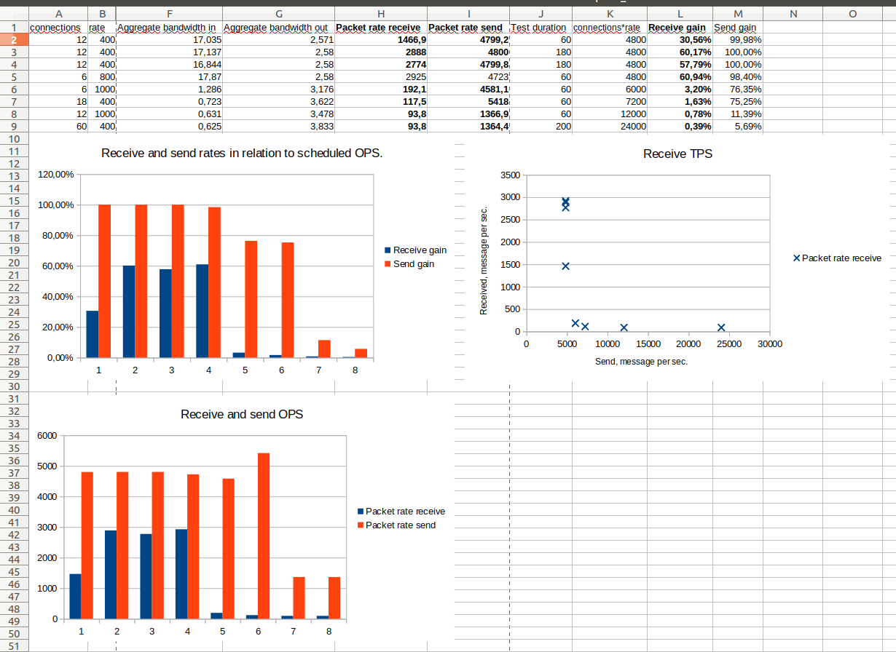

# Report on tcpkali test usage.

## Installation
Please follow the [Install](https://github.com/satori-com/tcpkali#install) guide of the `tcpkali Fast multi-core TCP and WebSockets load generator` project page.

## Running tests

### Latency measurement
Please take a look into [latency_limited_message_rate.sh](tcpkali/latency_limited_message_rate.sh)

Example:
```sh
tcpkali -vvv --ws -c100 -r @1000ms --connect-rate 10 \
--latency-marker "transaction_merkle_root" --message-stop "Assert Exception" \
-1 '{"method": "call", "params": [1, "database", []], "id": 3}'\
-m '{"method": "call", "params": [2, "get_block", [\{connection.uid}]], "id": 7}'\
newton.array.io:8090  2>&1 | tee latency_r@1000ms_c100.log
```

### Receive and send OPS measurement
Please take a look into [rate_test_message.sh](tcpkali/rate_test_message.sh)

Example:
```sh
tcpkali -T 60 -vvv -c6 -r1000 --ws \
-1 '{"method": "call", "params": [1, "database", []], "id": 3}' \
-m '{"method": "call", "params": [2, "get_block", [\{re [0-9]{1,4}}]], "id": 7}' \
hawking.array.io:8090 2>&1 | tee rate1000_c6.log
```

### Sheet covering several test results.
[Open Doc tcpkali_runs.ods](tcpkali/tcpkali_runs.ods) and [MS Excel tcpkali_runs.xls](tcpkali/tcpkali_runs.xls)


